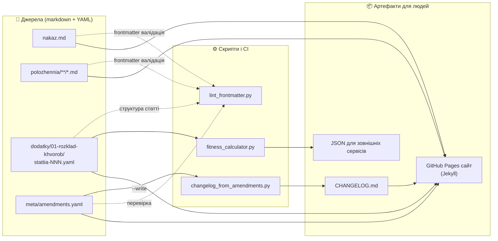
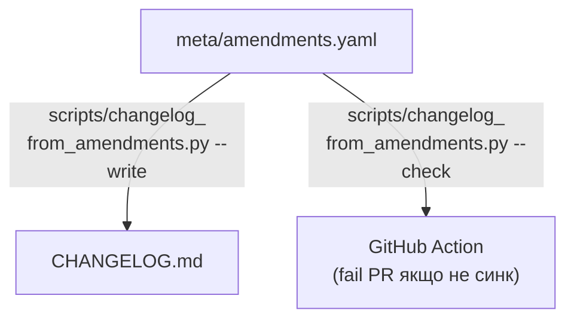
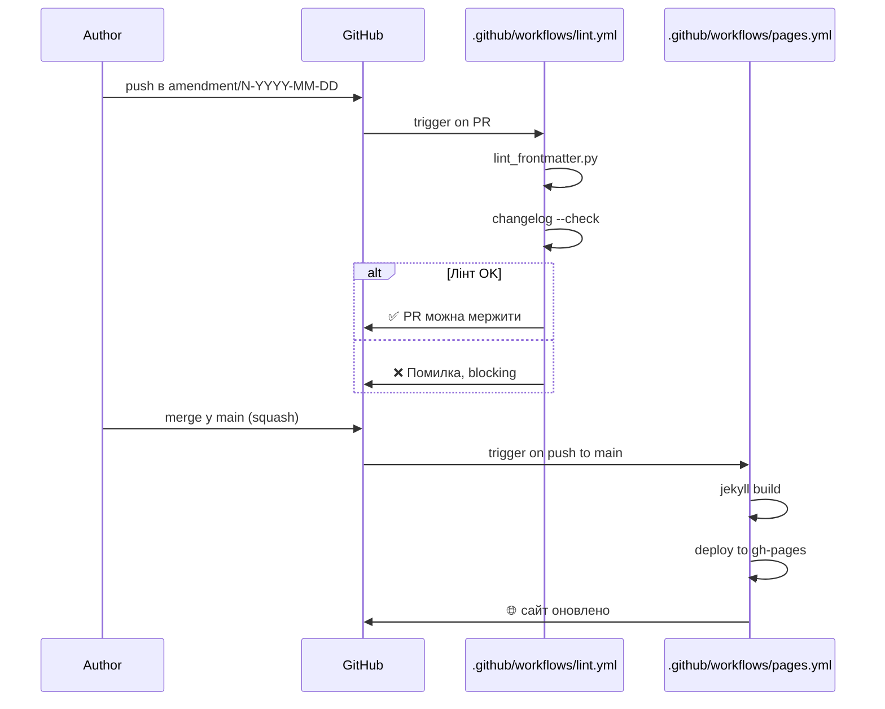

# Архітектура
{: .no_toc }

<details markdown="1">
<summary>На цій сторінці</summary>

- TOC
{:toc}

</details>

---

## Загальна схема



---

## Принципи зв'язування

### 1. `id` — спільна мова

Кожен пункт/глава/додаток має `id` у frontmatter. Цей `id`:

- стабільний навіки (не міняється з редакціями);
- унікальний у репо (валідується [`lint_frontmatter.py`](../scripts/lint_frontmatter.py));
- сумісний із «sub-id» — `polozhennia.r1.gl1.p1.4` валідний навіть якщо
  файл існує тільки на рівні глави (`polozhennia.r1.gl1`).

`meta/amendments.yaml` посилається на ці `id` у полі `affects`. Frontmatter
кожного зачепленого пункту посилається назад через `amended_by`. Лінтер
звіряє двостороннє посилання.

### 2. `amendments.yaml` — джерело правди про історію

Не CHANGELOG. CHANGELOG **генерується** з нього.



Якщо хтось додав запис у `amendments.yaml` і забув перегенерувати CHANGELOG —
CI це ловить.

### 3. `dodatky/01-rozklad-khvorob/stattia-NNN.yaml` — табличні дані

Розклад хвороб тримається як **окремі YAML-файли по статті**. Це дає:

- diff на рівні підпункту/графи (одна правка = один змінений рядок);
- лінтер може перевірити, що для кожної статті заповнені всі графи;
- [калькулятор придатності](../scripts/fitness_calculator.py) читає ці файли
  і відповідає програмно.

### 4. Сайт — функція від файлів

Jekyll бере **тільки** ті ж файли, що лежать у репо, додає тему `just-the-docs`,
будує статичний HTML і деплоїть на GitHub Pages. Ніяких окремих джерел
істини. Якщо файл зник з репо — він зник із сайту.

---

## Топологія репо

```
.
├── nakaz.md                    📄 структурна одиниця: nakaz
├── polozhennia/                📄 структурні одиниці: rozdil/glava/punkt
│   ├── 01-.../                       (Розділ I)
│   │   ├── 01-zagalni-...md            (Глава 1) ✅
│   │   ├── 02-organy-...md             (Глава 2) ✅
│   │   └── 03-rozhliad-...md           (Глава 3) 🟡
│   └── 02-.../                       (Розділ II)
├── dodatky/                    📦 «конфіги» (структуровані дані)
│   ├── 01-rozklad-khvorob/
│   │   ├── meta.yaml                   ← схема валідації
│   │   └── stattia-NNN.yaml × 3        ← дані
│   └── 02..05.md                       🟡 форми
├── meta/                       📚 метадані репо
│   ├── amendments.yaml                 ← джерело CHANGELOG
│   ├── glossary.md
│   └── schema.md                       ← граматика id, поля frontmatter
├── scripts/                    ⚙️ tooling
│   ├── lint_frontmatter.py
│   ├── changelog_from_amendments.py
│   └── fitness_calculator.py
├── .github/
│   ├── workflows/
│   │   ├── lint.yml                    ← CI на PR
│   │   └── pages.yml                   ← деплой сайту на push у main
│   ├── ISSUE_TEMPLATE/                 ← new-amendment, content-fix
│   └── PULL_REQUEST_TEMPLATE.md
├── docs/                       📖 пояснення для контриб'юторів
│   ├── how-it-works.md
│   ├── walkthrough.md
│   └── architecture.md                 ← цей файл
├── CONTRIBUTING.md
├── CHANGELOG.md                ⚙️ генерований
├── _config.yml + Gemfile       🌐 Jekyll
├── Makefile                    ⚙️ зручні шорткати
└── index.md / README.md        🌐 / 📄  landing для сайту і репо
```

---

## CI-конвеєр



---

## Чому така топологія дає швидкість погоджень

Класична правка НПА — це переписати плоский HTML/DOC на сотні сторінок.
Ревьюер дивиться на «всю редакцію» і шукає, що змінилось.

У нашій топології:

1. **Один PR = один наказ-зміна.** Diff чіткий: видно, які саме файли
   зачепило.
2. **Кожен зачеплений файл має `amended_by` запис.** Не треба здогадуватись,
   куди вкладається правка — структура говорить сама.
3. **Лінтер ловить пропуски** (наприклад, забули додати запис у
   `amendments.yaml` — `--check` фейлить).
4. **CHANGELOG генерується.** Розсинхрону «текст vs анотація змін» не буває.
5. **Калькулятор перебудовується автоматично** — якщо змінили категорію
   придатності в YAML, наступний запуск скрипту повертає нове значення без
   будь-яких правок коду.

Усе разом = час від «прийшов новий наказ» до «команда має оновлений
аналізатор» падає з тижнів до годин.
